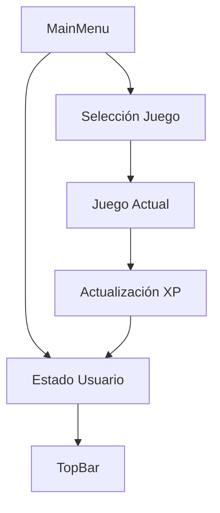

# MainMenu.tsx - Menú Principal

## Propósito
Gestiona la navegación entre juegos y el estado del usuario, actuando como hub central de la aplicación.

## Interfaces

### UserProfile
```typescript
interface UserProfile {
  name: string;
  level: number;
  xp: number;
  avatar: string;
}
```

## Estado
```typescript
const [juegoActual, setJuegoActual] = useState<string | null>(null);
const [user, setUser] = useState<UserProfile>(MOCK_USER);
const [showProfile, setShowProfile] = useState(false);
```

## Funcionamiento

### 1. Gestión de Juegos
```typescript
if (juegoActual === 'write-word') {
  return <WriteWordGame onExit={handleVolver} />;
}

if (juegoActual === 'trazo') {
  return <TraceLetterGame onExit={handleVolver} />;
}
```
- Renderizado condicional basado en selección
- Sistema de retorno unificado
- Manejo de estado persistente

### 2. Sistema de Progresión
```typescript
const handleGameComplete = (xpGained: number) => {
  setUser(prev => {
    const newXp = prev.xp + xpGained;
    const newLevel = Math.floor(newXp / 100) + 1;
    return {
      ...prev,
      xp: newXp,
      level: newLevel
    };
  });
};
```

### 3. Interfaz de Usuario
```typescript
return (
  <div className="main-menu">
    <TopBar 
      overrideXp={user.xp} 
      overrideLevel={user.level}
    />
    <div className="menu-container">
      <div className="games-grid">
        {/* Renderizado de juegos */}
      </div>
    </div>
  </div>
);
```

## Integración con Componentes

### Componentes Hijos
1. TopBar
   - Muestra XP y nivel
   - Controles globales

2. Juegos
   - WriteWordGame
   - TraceLetterGame
   - GamePlaceholder

### Flujo de Datos


## Sistema de Desbloqueo

### Configuración de Juegos
```typescript
const juegos = [
  {
    id: 'trazo',
    nombre: 'Trazado de Letras',
    nivel_requerido: 1,
    icono: '✏️'
  },
  {
    id: 'write-word',
    nombre: 'Escribir Palabras',
    nivel_requerido: 2,
    icono: '📝'
  }
];
```

### Lógica de Desbloqueo
```typescript
const isLocked = user.level < juego.nivel_requerido;
```

## Manejo de Estado

### Estado Local
- Juego actual
- Perfil de usuario
- Visibilidad de paneles

### Persistencia
- XP acumulado
- Nivel del usuario
- Juegos completados

## Eventos y Callbacks

### handleVolver
```typescript
const handleVolver = () => {
  setJuegoActual(null);
};
```

### handleGameComplete
```typescript
const handleGameComplete = (xpGained: number) => {
  // Actualización de XP y nivel
};
```

## Estilos y UI

### Clases CSS
- `.main-menu`: Contenedor principal
- `.menu-container`: Grid de juegos
- `.game-button`: Botones de juego
- `.lock-overlay`: Indicador de bloqueo

### Diseño Responsivo
- Grid adaptativo
- Diseño mobile-first
- Transiciones suaves

## Consideraciones Técnicas

### Performance
- Renderizado condicional eficiente
- Memoización de callbacks
- Optimización de re-renders

### Mantenibilidad
- Separación de responsabilidades
- Nombres descriptivos
- Tipado estricto

### Escalabilidad
- Fácil adición de nuevos juegos
- Sistema de niveles extensible
- Estructura modular 